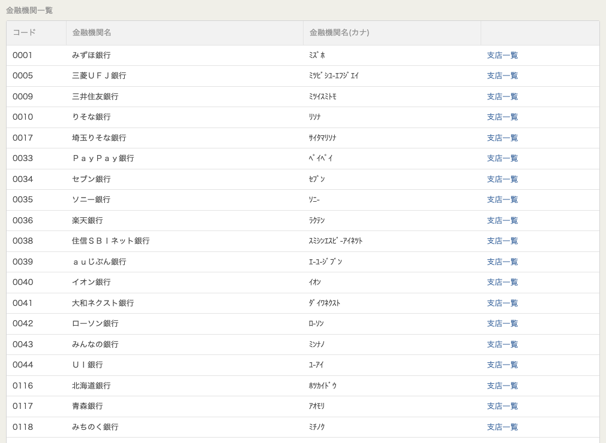
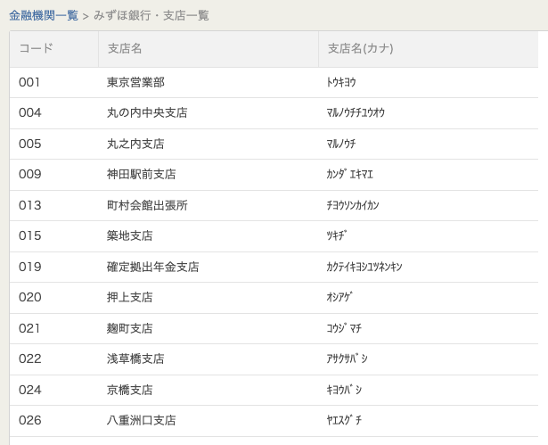

# coding guidelines

- file name should be snake_case
- function name should be snake_case
- TDD

# refs

- [deploy to Fly.io](https://fly.io/docs/elixir/getting-started/)
- [Elixir Phoenix on Fly](https://fly.io/docs/elixir/getting-started/#deploying-again)
- [Phoenix Rate Limit](https://dev.to/vkxni/rate-limits-phoenix-dmd)
- [漢字かな交じり文に、ひらがなとローマ字のふりがな（ルビ）を付けます。](https://developer.yahoo.co.jp/webapi/jlp/furigana/v2/furigana.html)

# 日本 金融機関一覧

TODO:

- [ ] 金融機関名（カナ）
- [ ] 支店一覧

